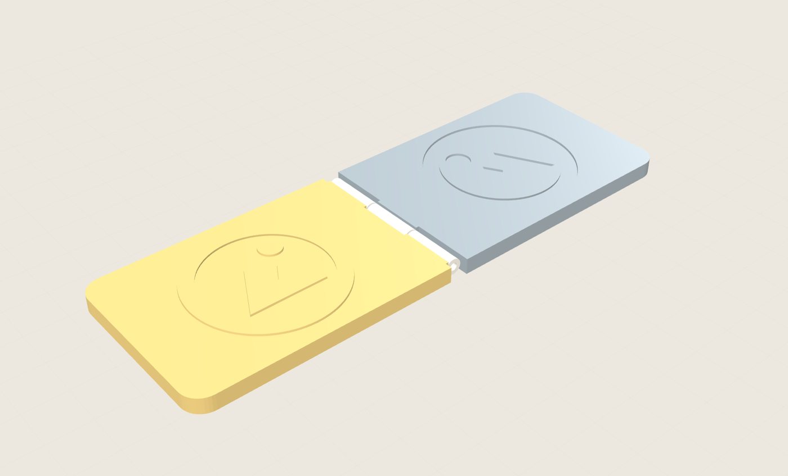

# Matriz de Relevo

### → [oviniciusramosp.github.io/matriz-de-relevo](https://oviniciusramosp.github.io/matriz-de-relevo/)

Abra o link, solte um SVG, baixe o STL. Nada é enviado para servidor nenhum: o arquivo
nunca sai do seu navegador.

Gerador de **matriz de relevo seco** (*dry embossing*) a partir de um SVG: a ferramenta lê o vetor,
monta a placa macho (alto-relevo) e a placa fêmea (cavidade espelhada, com a folga da espessura do
papel), fecha as duas com dobradiça ou ímãs e exporta STL / 3MF prontos para imprimir.

Roda inteiro no navegador. Sem build, sem servidor, sem dependência além do three.js por CDN.



## Rodar localmente

```bash
python3 -m http.server 8000
# http://localhost:8000
```

## Publicar sua própria cópia

Fork → `Settings → Pages → Source: Deploy from a branch → main / (root)`. `index.html` está na
raiz e todos os caminhos são relativos, então não há build nem configuração.

Único requisito de rede em produção: `cdn.jsdelivr.net` (three.js) e `fonts.googleapis.com`.

## O que ele faz

- lê `path`, `rect`, `circle`, `ellipse`, `polygon` com `transform` composto, achatando Bézier e arcos
  por desvio máximo
- descobre furos e ilhas por **profundidade de aninhamento** (funciona com `nonzero`, `evenodd` e
  vários `<path>` soltos)
- gera a fêmea espelhando no eixo da dobra e dilatando a tinta pela espessura do material
- 4 presets de material (lata de alumínio, papel 80–120 g, vegetal, cartão 300 g), cada um com seu
  par relevo/folga
- dobradiça procedural de 5, 7 ou 9 nós que **sai articulada da impressora**: eixo na altura da face gravada, barril de 3 mm apoiado em rampas de 45°, pino integral dentro do furo do nó vizinho — ou bolsos para 2/4 ímãs
- texto em 10 fontes, com curvatura, convertido em contorno real
- pré-visualização pinta o relevo e a cavidade numa cor própria, para enxergar a arte na peça
- saída de ângulo, simplificação de curvas e aviso quando um detalhe é fino demais para a folga
- exporta STL binário, 3MF multicolor e um zip com as partes separadas e os parâmetros usados

## Estrutura

| arquivo | responsabilidade |
|---|---|
| `svgpoly.js` | parser do `d`, achatamento de curvas, transforms, primitivas SVG |
| `geom.js` | polígonos 2D: área com sinal, ponto-em-polígono, aninhamento em árvore, offset por bissetriz, Douglas–Peucker, marching squares |
| `mesh.js` | sopa de triângulos, extrusão com furos, `buildPlate` (placa manifold), costura de bordas órfãs |
| `stamp.js` | regras do selo: presets, placas, dobradiça, ímãs, espelhamento e folga da fêmea |
| `text.js` | texto → contornos (rasteriza no canvas e extrai a curva de nível sub-pixel) |
| `exporters.js` | STL binário, zip *stored* com CRC-32, 3MF multicolor |
| `app.js` | interface, cena three.js, exportação |

Toda a geometria exportada é código próprio — o three.js entra só para desenhar a
pré-visualização e emprestar o triangulador (`ShapeUtils.triangulateShape`).

## Testes

O pipeline inteiro roda fora do navegador, o que permite verificar a malha de verdade:

```bash
npm install
npm test
```

`test/run.mjs` gera os dois modos (dobradiça e ímãs) a partir de um SVG patológico — anel com furo,
quadrado com furo e ilha, bordas exatamente colineares entre contornos distintos — e reporta, por
peça: triângulos, volume, triângulos degenerados e arestas sem par. Com `trimesh` instalado
(`pip install trimesh`) dá para confirmar de fora:

```
out-hinge.stl    watertight True   winding consistent True   6 sólidos
out-magnets.stl  watertight True   winding consistent True   2 sólidos
```

## Limitação conhecida

O offset por bissetriz não trata auto-interseção. Em folgas grandes (acima de ~0,4 mm) sobre curvas
de raio pequeno o anel pode se cruzar; o código detecta a degeneração pela inversão do sinal da área
e descarta aquele offset, mas o correto seria um Clipper em WASM. É a primeira dependência a
adicionar.

Mais contexto de projeto em [`docs/arquitetura.md`](docs/arquitetura.md).

## Licença

MIT.
